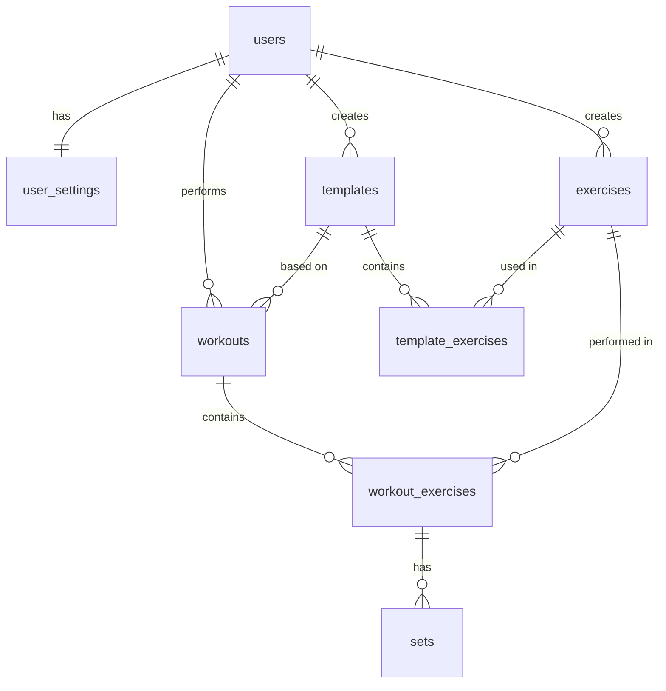

# Database Schema - Workout Tracker

## 1. Tables

### 1.1 `users`
Extends Supabase `auth.users` with application-specific profile data.

| Column       | Type                     | Constraints                              |
|--------------|--------------------------|------------------------------------------|
| `id`         | `UUID`                   | `PRIMARY KEY`, `REFERENCES auth.users(id) ON DELETE CASCADE` |
| `email`      | `TEXT`                   | `NOT NULL`                               |
| `created_at` | `TIMESTAMPTZ`            | `NOT NULL DEFAULT NOW()`                 |
| `updated_at` | `TIMESTAMPTZ`            | `NOT NULL DEFAULT NOW()`                 |

---

### 1.2 `user_settings`
Stores user preferences (1:1 relationship with `users`).

| Column             | Type                     | Constraints                              |
|--------------------|--------------------------|------------------------------------------|
| `id`               | `UUID`                   | `PRIMARY KEY DEFAULT gen_random_uuid()`  |
| `user_id`          | `UUID`                   | `NOT NULL UNIQUE`, `REFERENCES users(id) ON DELETE CASCADE` |
| `default_weight_unit` | `TEXT`                | `NOT NULL DEFAULT 'kg'`, `CHECK (default_weight_unit IN ('kg', 'lbs'))` |
| `rest_timer_duration` | `INTEGER`             | `NOT NULL DEFAULT 90`, `CHECK (rest_timer_duration > 0)` |
| `theme`            | `TEXT`                   | `NOT NULL DEFAULT 'dark'`, `CHECK (theme IN ('dark', 'light', 'system'))` |
| `created_at`       | `TIMESTAMPTZ`            | `NOT NULL DEFAULT NOW()`                 |
| `updated_at`       | `TIMESTAMPTZ`            | `NOT NULL DEFAULT NOW()`                 |

---

### 1.3 `exercises`
Centralized table for both system-defined and user-created exercises.

| Column              | Type                     | Constraints                              |
|---------------------|--------------------------|------------------------------------------|
| `id`                | `UUID`                   | `PRIMARY KEY DEFAULT gen_random_uuid()`  |
| `name`              | `TEXT`                   | `NOT NULL`                               |
| `target_muscle_group` | `TEXT`                 | `NOT NULL`                               |
| `is_system`         | `BOOLEAN`                | `NOT NULL DEFAULT FALSE`                 |
| `user_id`           | `UUID`                   | `REFERENCES users(id) ON DELETE CASCADE` |
| `created_at`        | `TIMESTAMPTZ`            | `NOT NULL DEFAULT NOW()`                 |
| `updated_at`        | `TIMESTAMPTZ`            | `NOT NULL DEFAULT NOW()`                 |
| `deleted_at`        | `TIMESTAMPTZ`            | `NULL`                                   |

**Constraints:**
- `CHECK ((is_system = TRUE AND user_id IS NULL) OR (is_system = FALSE AND user_id IS NOT NULL))`
- Unique index on `(LOWER(name), user_id)` where `deleted_at IS NULL` for user exercises

**Valid `target_muscle_group` values:** `chest`, `back`, `shoulders`, `biceps`, `triceps`, `forearms`, `core`, `quadriceps`, `hamstrings`, `glutes`, `calves`, `full_body`

---

### 1.4 `templates`
Workout templates (blueprints) created by users or provided by the system.

| Column       | Type                     | Constraints                              |
|--------------|--------------------------|------------------------------------------|
| `id`         | `UUID`                   | `PRIMARY KEY DEFAULT gen_random_uuid()`  |
| `user_id`    | `UUID`                   | `REFERENCES users(id) ON DELETE CASCADE` |
| `name`       | `TEXT`                   | `NOT NULL`                               |
| `is_system`  | `BOOLEAN`                | `NOT NULL DEFAULT FALSE`                 |
| `created_at` | `TIMESTAMPTZ`            | `NOT NULL DEFAULT NOW()`                 |
| `updated_at` | `TIMESTAMPTZ`            | `NOT NULL DEFAULT NOW()`                 |
| `deleted_at` | `TIMESTAMPTZ`            | `NULL`                                   |

**Constraints:**
- `CHECK ((is_system = TRUE AND user_id IS NULL) OR (is_system = FALSE AND user_id IS NOT NULL))`

---

### 1.5 `template_exercises`
Join table linking templates to exercises with ordering.

| Column        | Type                     | Constraints                              |
|---------------|--------------------------|------------------------------------------|
| `id`          | `UUID`                   | `PRIMARY KEY DEFAULT gen_random_uuid()`  |
| `template_id` | `UUID`                   | `NOT NULL`, `REFERENCES templates(id) ON DELETE CASCADE` |
| `exercise_id` | `UUID`                   | `NOT NULL`, `REFERENCES exercises(id) ON DELETE CASCADE` |
| `sort_order`  | `INTEGER`                | `NOT NULL DEFAULT 0`                     |
| `sets_count`  | `INTEGER`                | `NOT NULL DEFAULT 3`, `CHECK (sets_count > 0)` |
| `created_at`  | `TIMESTAMPTZ`            | `NOT NULL DEFAULT NOW()`                 |
| `updated_at`  | `TIMESTAMPTZ`            | `NOT NULL DEFAULT NOW()`                 |

---

### 1.6 `workouts`
Represents a completed or in-progress workout session.

| Column        | Type                     | Constraints                              |
|---------------|--------------------------|------------------------------------------|
| `id`          | `UUID`                   | `PRIMARY KEY DEFAULT gen_random_uuid()`  |
| `user_id`     | `UUID`                   | `NOT NULL`, `REFERENCES users(id) ON DELETE CASCADE` |
| `template_id` | `UUID`                   | `REFERENCES templates(id) ON DELETE SET NULL` |
| `name`        | `TEXT`                   | `NULL`                                   |
| `status`      | `TEXT`                   | `NOT NULL DEFAULT 'IN_PROGRESS'`, `CHECK (status IN ('IN_PROGRESS', 'COMPLETED'))` |
| `started_at`  | `TIMESTAMPTZ`            | `NOT NULL DEFAULT NOW()`                 |
| `completed_at`| `TIMESTAMPTZ`            | `NULL`                                   |
| `notes`       | `TEXT`                   | `NULL`                                   |
| `created_at`  | `TIMESTAMPTZ`            | `NOT NULL DEFAULT NOW()`                 |
| `updated_at`  | `TIMESTAMPTZ`            | `NOT NULL DEFAULT NOW()`                 |
| `deleted_at`  | `TIMESTAMPTZ`            | `NULL`                                   |

---

### 1.7 `workout_exercises`
Join table linking workouts to exercises with ordering.

| Column        | Type                     | Constraints                              |
|---------------|--------------------------|------------------------------------------|
| `id`          | `UUID`                   | `PRIMARY KEY DEFAULT gen_random_uuid()`  |
| `workout_id`  | `UUID`                   | `NOT NULL`, `REFERENCES workouts(id) ON DELETE CASCADE` |
| `exercise_id` | `UUID`                   | `NOT NULL`, `REFERENCES exercises(id) ON DELETE CASCADE` |
| `sort_order`  | `INTEGER`                | `NOT NULL DEFAULT 0`                     |
| `created_at`  | `TIMESTAMPTZ`            | `NOT NULL DEFAULT NOW()`                 |
| `updated_at`  | `TIMESTAMPTZ`            | `NOT NULL DEFAULT NOW()`                 |
| `deleted_at`  | `TIMESTAMPTZ`            | `NULL`                                   |

---

### 1.8 `sets`
Individual set records within a workout exercise.

| Column              | Type                     | Constraints                              |
|---------------------|--------------------------|------------------------------------------|
| `id`                | `UUID`                   | `PRIMARY KEY DEFAULT gen_random_uuid()`  |
| `workout_exercise_id` | `UUID`                 | `NOT NULL`, `REFERENCES workout_exercises(id) ON DELETE CASCADE` |
| `weight`            | `NUMERIC(6,2)`           | `NOT NULL DEFAULT 0`, `CHECK (weight >= 0)` |
| `reps`              | `INTEGER`                | `NOT NULL DEFAULT 0`, `CHECK (reps >= 0)` |
| `set_type`          | `TEXT`                   | `NOT NULL DEFAULT 'WORKING'`, `CHECK (set_type IN ('WARMUP', 'WORKING', 'DROPSET', 'FAILURE'))` |
| `is_completed`      | `BOOLEAN`                | `NOT NULL DEFAULT FALSE`                 |
| `sort_order`        | `INTEGER`                | `NOT NULL DEFAULT 0`                     |
| `created_at`        | `TIMESTAMPTZ`            | `NOT NULL DEFAULT NOW()`                 |
| `updated_at`        | `TIMESTAMPTZ`            | `NOT NULL DEFAULT NOW()`                 |
| `deleted_at`        | `TIMESTAMPTZ`            | `NULL`                                   |

---

## 2. Relationships



| Relationship                     | Cardinality | Description                                      |
|----------------------------------|-------------|--------------------------------------------------|
| `users` ↔ `user_settings`        | 1:1         | Each user has exactly one settings record        |
| `users` → `exercises`            | 1:N         | User can create multiple custom exercises        |
| `users` → `templates`            | 1:N         | User can create multiple templates               |
| `users` → `workouts`             | 1:N         | User can have multiple workouts                  |
| `templates` → `template_exercises` | 1:N       | Template contains multiple exercises             |
| `exercises` → `template_exercises` | 1:N       | Exercise can be in multiple templates            |
| `templates` → `workouts`         | 1:N (optional) | Workout may be based on a template            |
| `workouts` → `workout_exercises` | 1:N         | Workout contains multiple exercises              |
| `exercises` → `workout_exercises`| 1:N         | Exercise can be performed in multiple workouts   |
| `workout_exercises` → `sets`     | 1:N         | Each workout exercise has multiple sets          |

---

## 3. Indexes

### Primary & Foreign Key Indexes
```sql
-- Foreign key indexes (for join performance)
CREATE INDEX idx_user_settings_user_id ON user_settings(user_id);
CREATE INDEX idx_exercises_user_id ON exercises(user_id) WHERE user_id IS NOT NULL;
CREATE INDEX idx_templates_user_id ON templates(user_id) WHERE user_id IS NOT NULL;
CREATE INDEX idx_workouts_user_id ON workouts(user_id);
CREATE INDEX idx_workouts_template_id ON workouts(template_id) WHERE template_id IS NOT NULL;
CREATE INDEX idx_template_exercises_template_id ON template_exercises(template_id);
CREATE INDEX idx_template_exercises_exercise_id ON template_exercises(exercise_id);
CREATE INDEX idx_workout_exercises_workout_id ON workout_exercises(workout_id);
CREATE INDEX idx_workout_exercises_exercise_id ON workout_exercises(exercise_id);
CREATE INDEX idx_sets_workout_exercise_id ON sets(workout_exercise_id);
```

### Performance Indexes
```sql
-- Composite index for "previous best" lookups (critical for <15ms retrieval)
CREATE INDEX idx_workout_exercises_exercise_created 
    ON workout_exercises(exercise_id, created_at DESC);

-- Index for exercise search by name
CREATE INDEX idx_exercises_name_lower ON exercises(LOWER(name));

-- Index for filtering exercises by muscle group
CREATE INDEX idx_exercises_muscle_group ON exercises(target_muscle_group);

-- Index for workout history queries
CREATE INDEX idx_workouts_user_completed ON workouts(user_id, completed_at DESC) 
    WHERE deleted_at IS NULL AND status = 'COMPLETED';

-- Index for syncing (PowerSync uses updated_at)
CREATE INDEX idx_workouts_updated ON workouts(updated_at);
CREATE INDEX idx_workout_exercises_updated ON workout_exercises(updated_at);
CREATE INDEX idx_sets_updated ON sets(updated_at);
```

### Unique Indexes
```sql
-- Unique user exercise names (case-insensitive, excluding soft-deleted)
CREATE UNIQUE INDEX idx_exercises_user_name_unique 
    ON exercises(LOWER(name), user_id) 
    WHERE user_id IS NOT NULL AND deleted_at IS NULL;

-- Unique system exercise names
CREATE UNIQUE INDEX idx_exercises_system_name_unique 
    ON exercises(LOWER(name)) 
    WHERE is_system = TRUE AND deleted_at IS NULL;
```

---

## 4. Row Level Security (RLS) Policies

### Enable RLS on all tables
```sql
ALTER TABLE users ENABLE ROW LEVEL SECURITY;
ALTER TABLE user_settings ENABLE ROW LEVEL SECURITY;
ALTER TABLE exercises ENABLE ROW LEVEL SECURITY;
ALTER TABLE templates ENABLE ROW LEVEL SECURITY;
ALTER TABLE template_exercises ENABLE ROW LEVEL SECURITY;
ALTER TABLE workouts ENABLE ROW LEVEL SECURITY;
ALTER TABLE workout_exercises ENABLE ROW LEVEL SECURITY;
ALTER TABLE sets ENABLE ROW LEVEL SECURITY;
```

### `users` Table Policies
```sql
CREATE POLICY "Users can view own profile"
    ON users FOR SELECT
    USING (auth.uid() = id);

CREATE POLICY "Users can update own profile"
    ON users FOR UPDATE
    USING (auth.uid() = id);
```

### `user_settings` Table Policies
```sql
CREATE POLICY "Users can view own settings"
    ON user_settings FOR SELECT
    USING (auth.uid() = user_id);

CREATE POLICY "Users can insert own settings"
    ON user_settings FOR INSERT
    WITH CHECK (auth.uid() = user_id);

CREATE POLICY "Users can update own settings"
    ON user_settings FOR UPDATE
    USING (auth.uid() = user_id);
```

### `exercises` Table Policies
```sql
-- System exercises readable by all authenticated users
CREATE POLICY "Anyone can view system exercises"
    ON exercises FOR SELECT
    USING (is_system = TRUE);

-- User exercises only visible to owner
CREATE POLICY "Users can view own exercises"
    ON exercises FOR SELECT
    USING (auth.uid() = user_id);

CREATE POLICY "Users can insert own exercises"
    ON exercises FOR INSERT
    WITH CHECK (auth.uid() = user_id AND is_system = FALSE);

CREATE POLICY "Users can update own exercises"
    ON exercises FOR UPDATE
    USING (auth.uid() = user_id AND is_system = FALSE);

CREATE POLICY "Users can delete own exercises"
    ON exercises FOR DELETE
    USING (auth.uid() = user_id AND is_system = FALSE);
```

### `templates` Table Policies
```sql
CREATE POLICY "Anyone can view system templates"
    ON templates FOR SELECT
    USING (is_system = TRUE);

CREATE POLICY "Users can view own templates"
    ON templates FOR SELECT
    USING (auth.uid() = user_id);

CREATE POLICY "Users can insert own templates"
    ON templates FOR INSERT
    WITH CHECK (auth.uid() = user_id AND is_system = FALSE);

CREATE POLICY "Users can update own templates"
    ON templates FOR UPDATE
    USING (auth.uid() = user_id AND is_system = FALSE);

CREATE POLICY "Users can delete own templates"
    ON templates FOR DELETE
    USING (auth.uid() = user_id AND is_system = FALSE);
```

### `template_exercises` Table Policies
```sql
CREATE POLICY "Users can view template exercises for accessible templates"
    ON template_exercises FOR SELECT
    USING (
        EXISTS (
            SELECT 1 FROM templates 
            WHERE templates.id = template_exercises.template_id 
            AND (templates.is_system = TRUE OR templates.user_id = auth.uid())
        )
    );

CREATE POLICY "Users can manage template exercises for own templates"
    ON template_exercises FOR ALL
    USING (
        EXISTS (
            SELECT 1 FROM templates 
            WHERE templates.id = template_exercises.template_id 
            AND templates.user_id = auth.uid()
        )
    );
```

### `workouts` Table Policies
```sql
CREATE POLICY "Users can view own workouts"
    ON workouts FOR SELECT
    USING (auth.uid() = user_id);

CREATE POLICY "Users can insert own workouts"
    ON workouts FOR INSERT
    WITH CHECK (auth.uid() = user_id);

CREATE POLICY "Users can update own workouts"
    ON workouts FOR UPDATE
    USING (auth.uid() = user_id);

CREATE POLICY "Users can delete own workouts"
    ON workouts FOR DELETE
    USING (auth.uid() = user_id);
```

### `workout_exercises` Table Policies
```sql
CREATE POLICY "Users can view own workout exercises"
    ON workout_exercises FOR SELECT
    USING (
        EXISTS (
            SELECT 1 FROM workouts 
            WHERE workouts.id = workout_exercises.workout_id 
            AND workouts.user_id = auth.uid()
        )
    );

CREATE POLICY "Users can manage own workout exercises"
    ON workout_exercises FOR ALL
    USING (
        EXISTS (
            SELECT 1 FROM workouts 
            WHERE workouts.id = workout_exercises.workout_id 
            AND workouts.user_id = auth.uid()
        )
    );
```

### `sets` Table Policies
```sql
CREATE POLICY "Users can view own sets"
    ON sets FOR SELECT
    USING (
        EXISTS (
            SELECT 1 FROM workout_exercises
            JOIN workouts ON workouts.id = workout_exercises.workout_id
            WHERE workout_exercises.id = sets.workout_exercise_id 
            AND workouts.user_id = auth.uid()
        )
    );

CREATE POLICY "Users can manage own sets"
    ON sets FOR ALL
    USING (
        EXISTS (
            SELECT 1 FROM workout_exercises
            JOIN workouts ON workouts.id = workout_exercises.workout_id
            WHERE workout_exercises.id = sets.workout_exercise_id 
            AND workouts.user_id = auth.uid()
        )
    );
```

---

## 5. Additional Notes

### 5.1 Design Decisions

1. **UUID Primary Keys**: All tables use UUIDs to support offline ID generation required by PowerSync and Local-First architecture.

2. **Soft Deletes (`deleted_at`)**: Implemented on all user-modifiable tables to support PowerSync's tombstoning mechanism for synchronization.

3. **Timestamps (`created_at`, `updated_at`)**: Present on all tables to enable "Last Write Wins" conflict resolution during sync.

4. **Weight Storage**: All weights stored in `kg` as `NUMERIC(6,2)` allowing values up to 9999.99 kg with 2 decimal precision.

5. **No REST Timer Storage**: Per session decisions, active timer state is managed in Zustand on the client, not persisted to DB.

6. **No Pre-calculated Statistics Tables**: Heatmap and volume data will be calculated dynamically via queries or in-app for MVP.

7. **Template Deletion Handling**: Using `ON DELETE SET NULL` for `workouts.template_id` combined with soft deletes on templates.

8. **Exercise Name Changes**: Historical workout data links by `exercise_id`, so name changes propagate to history (accepted trade-off).

### 5.2 Enum Values Reference

| Field                  | Valid Values                                    |
|------------------------|-------------------------------------------------|
| `workouts.status`      | `IN_PROGRESS`, `COMPLETED`                      |
| `sets.set_type`        | `WARMUP`, `WORKING`, `DROPSET`, `FAILURE`       |
| `user_settings.theme`  | `dark`, `light`, `system`                       |
| `user_settings.default_weight_unit` | `kg`, `lbs`                        |
| `exercises.target_muscle_group` | `chest`, `back`, `shoulders`, `biceps`, `triceps`, `forearms`, `core`, `quadriceps`, `hamstrings`, `glutes`, `calves`, `full_body` |

### 5.3 Trigger for `updated_at`

Create a reusable trigger function to automatically update `updated_at`:

```sql
CREATE OR REPLACE FUNCTION update_updated_at_column()
RETURNS TRIGGER AS $$
BEGIN
    NEW.updated_at = NOW();
    RETURN NEW;
END;
$$ LANGUAGE plpgsql;

-- Apply to all tables
CREATE TRIGGER update_users_updated_at
    BEFORE UPDATE ON users
    FOR EACH ROW EXECUTE FUNCTION update_updated_at_column();

CREATE TRIGGER update_user_settings_updated_at
    BEFORE UPDATE ON user_settings
    FOR EACH ROW EXECUTE FUNCTION update_updated_at_column();

CREATE TRIGGER update_exercises_updated_at
    BEFORE UPDATE ON exercises
    FOR EACH ROW EXECUTE FUNCTION update_updated_at_column();

CREATE TRIGGER update_templates_updated_at
    BEFORE UPDATE ON templates
    FOR EACH ROW EXECUTE FUNCTION update_updated_at_column();

CREATE TRIGGER update_template_exercises_updated_at
    BEFORE UPDATE ON template_exercises
    FOR EACH ROW EXECUTE FUNCTION update_updated_at_column();

CREATE TRIGGER update_workouts_updated_at
    BEFORE UPDATE ON workouts
    FOR EACH ROW EXECUTE FUNCTION update_updated_at_column();

CREATE TRIGGER update_workout_exercises_updated_at
    BEFORE UPDATE ON workout_exercises
    FOR EACH ROW EXECUTE FUNCTION update_updated_at_column();

CREATE TRIGGER update_sets_updated_at
    BEFORE UPDATE ON sets
    FOR EACH ROW EXECUTE FUNCTION update_updated_at_column();
```

### 5.4 User Creation Trigger

Auto-create public user profile when new auth user is created:

```sql
CREATE OR REPLACE FUNCTION handle_new_user()
RETURNS TRIGGER AS $$
BEGIN
    INSERT INTO public.users (id, email, created_at, updated_at)
    VALUES (NEW.id, NEW.email, NOW(), NOW());
    
    INSERT INTO public.user_settings (user_id, created_at, updated_at)
    VALUES (NEW.id, NOW(), NOW());
    
    RETURN NEW;
END;
$$ LANGUAGE plpgsql SECURITY DEFINER;

CREATE TRIGGER on_auth_user_created
    AFTER INSERT ON auth.users
    FOR EACH ROW EXECUTE FUNCTION handle_new_user();
```
