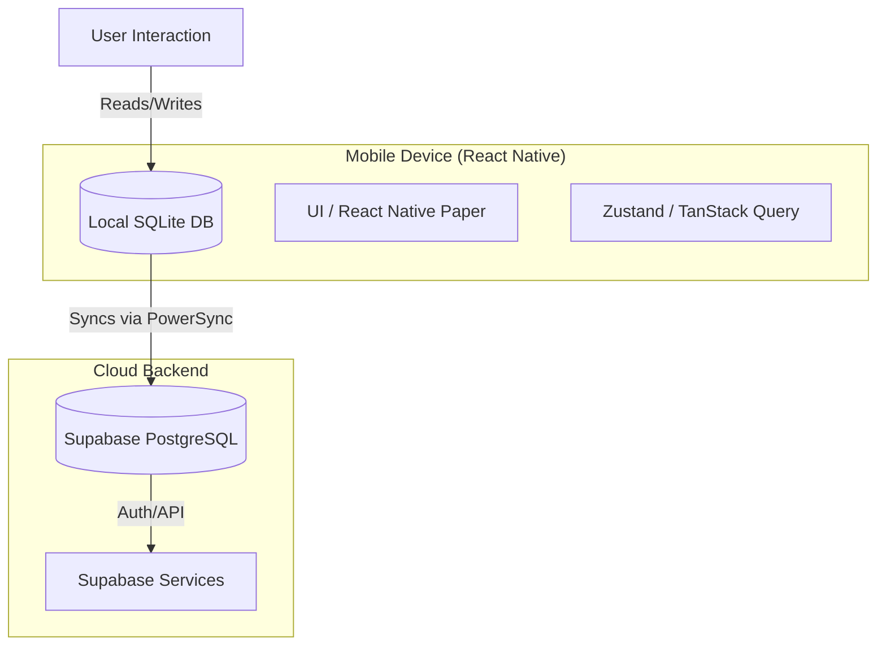

# Technology Stack Documentation - Workout Tracker

## 1. Executive Summary
This document outlines the chosen technology stack for the "Local First" Workout Tracker application. The selected technologies prioritize rapid MVP delivery, robust offline capabilities, and long-term scalability while minimizing initial operational costs.

## 2. Architecture Overview
The application follows a **Local-First** architecture. The source of truth for the user interface is the local SQLite database, ensuring immediate responsiveness and full functionality without internet access. Background synchronization handles data consistency with the cloud.

## 3. Tech Stack Components

### 3.1 Mobile Application (Frontend)
*   **Framework**: **React Native** with **Expo SDK**.
    *   *Rationale*: fast development cycle, over-the-air updates (OTA), and excellent cross-platform support (iOS & Android) from a single codebase.
*   **Language**: **TypeScript 5**.
    *   *Rationale*: Ensures type safety, reduces runtime errors, and improves developer experience with autocomplete/refactoring tools.
*   **UI Library**: **React Native Paper**.
    *   *Rationale*: Provides a comprehensive set of production-ready, accessible, and Material Design-compliant components, significantly speeding up UI development.
*   **Styling**: **NativeWind** (Tailwind CSS for React Native).
    *   *Rationale*: Allows for rapid styling using familiar utility classes, reducing the boilerplate of `StyleSheet.create`.
*   **State Management**:
    *   **Zustand**: For transient global UI state (e.g., current workout timer status, modal visibility).
    *   **TanStack Query**: For managing server state and asynchronous data fetching where direct DB access isn't applicable.

### 3.2 Offline-First Data Layer
This is the most critical component for meeting the "Gym Environment" requirements.

*   **Local Database**: **Expo SQLite**.
    *   *Rationale*: The standard, reliable SQL engine for mobile devices.
*   **ORM**: **Drizzle ORM**.
    *   *Rationale*: Lightweight, type-safe, and has excellent performance compared to heavier alternatives like TypeORM. It couples tightly with TypeScript schemas.
*   **Synchronization Engine**: **PowerSync**.
    *   *Rationale*: Automates the complex process of syncing local SQLite with remote PostgreSQL. It handles:
        *   Background syncing.
        *   Conflict resolution.
        *   Queuing offline writes.
        *   Drastically reduces the custom code needed for "Offline Mode".

### 3.3 Backend Infrastructure (BaaS)
*   **Platform**: **Supabase**.
    *   *Rationale*: Open-source alternative to Firebase providing a full backend suite without vendor lock-in issues.
*   **Database**: **PostgreSQL**.
    *   *Rationale*: Industry-standard relational database, essential for structured workout data (Users -> Workouts -> Exercises -> Sets).
*   **Authentication**: **Supabase Auth**.
    *   *Rationale*: Secure email/password login, social providers, and seamless integration with RLS (Row Level Security).
*   **Security**: **Row Level Security (RLS)**.
    *   *Rationale*: Security policies are defined directly on the database tables, ensuring users can only access their own data, regardless of client-side implementation.

### 3.4 CI/CD & Hosting
*   **Version Control**: **GitHub**.
*   **CI/CD**: **GitHub Actions**.
    *   *Rationale*: Automates linting, type checking, and testing on every Pull Request.
*   **Mobile Build & Hosting**: **Expo Application Services (EAS)**.
    *   *Rationale*:
        *   **EAS Build**: Compiles Android (APK/AAB) and iOS (IPA) binaries in the cloud without needing a Mac locally.
        *   **EAS Update**: Pushes critical bug fixes directly to users' devices instantly.

## 4. Critical Analysis & Fit
*   **Speed to MVP**: High. Using UI kits (Paper) and BaaS (Supabase) + Sync Engine (PowerSync) eliminates ~70% of boilerplate code.
*   **Scalability**: High. PostgreSQL handles millions of rows effortlessly. React Native scales to complex native apps.
*   **Cost**: Low/Zero. All selected tools have generous free tiers suitable for development and early production (Supabase Free Tier, Expo Free Plan, Github Free).
